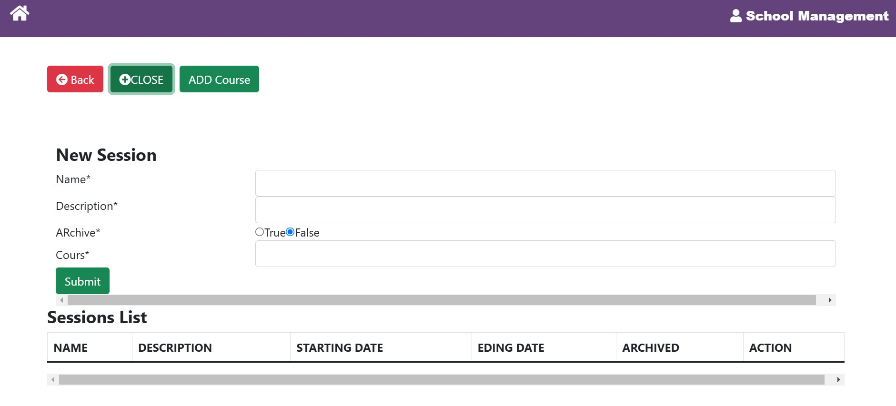
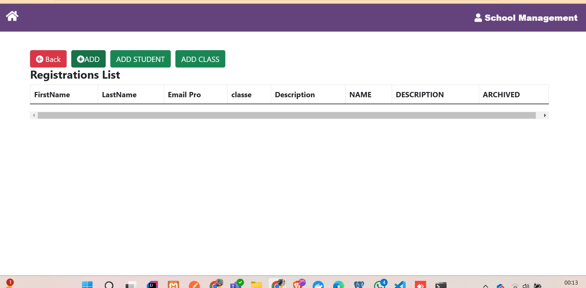
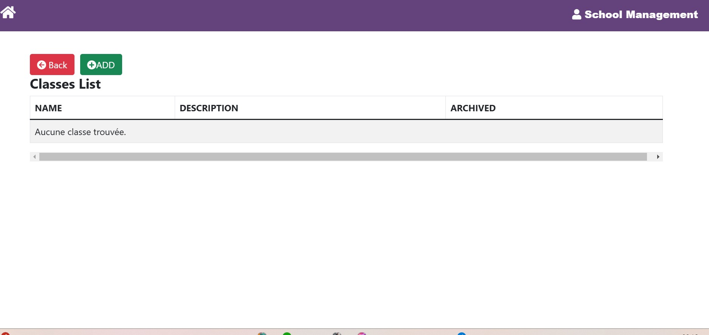
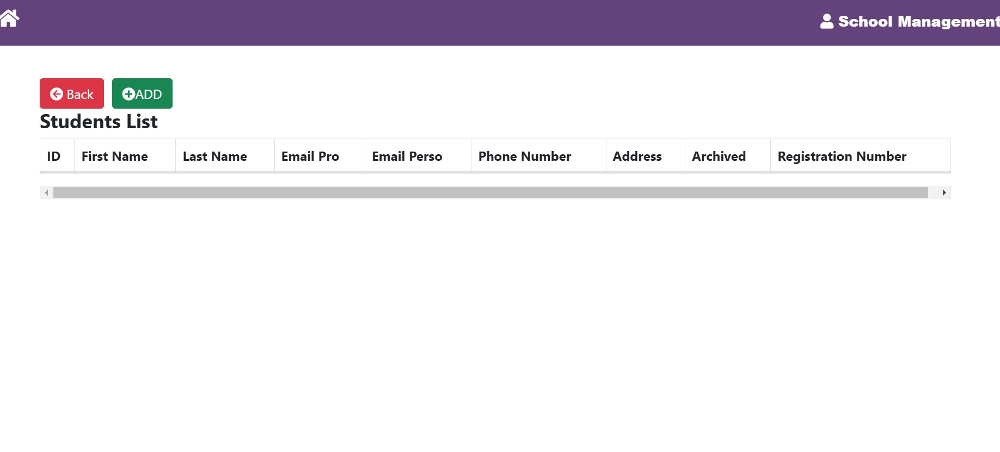

# 📦 SuivieConteneur API

Bienvenue dans **SCHOOL MANAGEMENT API**, une mini application de gestion d'école.

## 🚀 Installation

### Prérequis
Avant de commencer, assurez-vous d'avoir installé les éléments suivants sur votre machine :

- **Java 17** pour Spring Boot
- **Maven** (ou Gradle) pour la gestion des dépendances
- **Node.js** et **npm** et **anguar17** pour Angular
- **MySQL** (ou autre base de données)
- **IDE** comme IntelliJ IDEA ou VS Code pour le développement

---

### Étapes Backend - Spring Boot (Java 17)

1. Clonez le dépôt sur votre machine :
   ```bash
   git clone https://github.com/trasemamadou/EXAMEN_ANGULAR_SPRINGBOOT.git
   cd EXAMEN_ANGULAR_SPRINGBOOT
### ENDPOINTS (Java 17) 

#### **************** ETUDIANT **************** ####
http://localhost:8083/api/students

{ 
  "firstName": "Mohamed",
  "lastName": "TRAORE",
  "emailPro": "mohatraore@gmail.com",
  "emailPerso": "mohatraore@gmail.com",
  "phoneNumber": "+221 776246630",
  "address": "12 Rue des Écoles, Paris",
  "archive": false,
  "registrationNu": "REG2024001"
}

#### **************** CLASSE **************** ####

http://localhost:8083/api/classes 
{
"name": "M2GL",
"description": "Cours de programmation avancées",
"archive": false
}

#### **************** SESSION **************** ####
http://localhost:8083/api/sessions 
{
"name": "DECEMBRE", 
"description": "SESSION DE DECEMBRE",
"archive": false,
"courseId":1
}
#### **************** COURSE **************** ####
http://localhost:8083/api/courses

{   
 "description": "COURS SUR DEVOPS",
 "name": "DEVOPS",
 "archive": false,
 "classeId":1
} 
#### **************** REGISTRATION **************** ####
http://localhost:8083/api/registrations

{
"name": "Mathématiques",
"description": "Cours de mathématiques avancées",
"archive": false,
"classeId": 1,
"studentId": 10
}

## 🚀 FRONTEND ANGULAR

### Prérequis




 